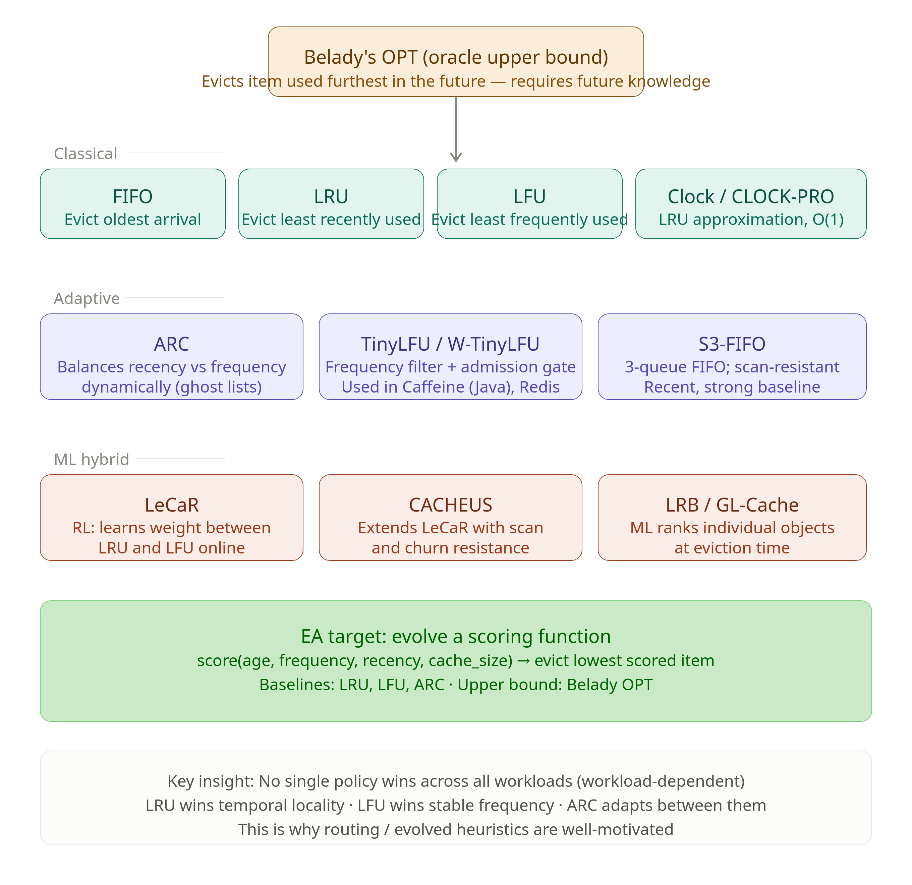

# Evolving Cache Replacement Policies

This example uses OpenEvolve to **discover cache replacement heuristics** — evolving
a scoring function that decides which cached item to evict — and benchmarks the
result against the best human-designed policies (LRU, LFU, ARC) with Belady's
optimal algorithm as the theoretical ceiling.



## Problem Description

A cache holds a fixed number of items. On a miss to a full cache, the policy must
choose a victim to evict. The choice is **workload-dependent**: no single human
heuristic wins everywhere. LRU exploits temporal locality; LFU exploits stable
popularity; ARC adapts between them — but each has workloads where it collapses.
That gap between any fixed policy and the optimum is what evolution targets.

**Key insight:** because the best policy depends on the workload, an evolved,
workload-aware heuristic is well-motivated — and there is measurable headroom
between LRU and the Belady optimum to capture (see below).

## What Gets Evolved

The evolvable surface is a single pure scoring function. The fixed simulator
evicts the **lowest-scored** resident item:

```python
def score(age, frequency, recency, size, cache_size, now) -> float:
    """Higher score = more valuable = keep. Lowest-scored resident is evicted.
    age        = now - insert_time
    frequency  = total access count while resident
    recency    = now - last_access_time
    size       = item size (1 in the uniform-cost experiments)
    cache_size = capacity (constant within a run)
    now        = current logical timestamp
    """
    return -recency   # seed program == LRU (evict the least recently used)
```

The seed `score = -recency` reproduces **LRU exactly**, so iteration 0 is a known,
sane baseline. Evolution mutates this expression — combining age, frequency, and
recency — to beat the baselines across diverse workloads.

The simulator, baselines, and trace generation are **fixed** (not evolvable); only
the code inside the `# EVOLVE-BLOCK` markers changes. This protects the interface
from LLM signature drift. See `IMPLEMENTATION.md` for the full design.

## Baselines & Oracle

The human-designed heuristics are **comparators, not contestants** — the evaluator
runs each over the same traces to produce reference hit rates.

**Classical:** **LRU** evicts the item not accessed for the longest time (bets on
temporal locality). **LFU** evicts the item accessed least often overall. **CLOCK**
approximates LRU with a circular buffer and a "clock hand," cutting bookkeeping.

**Adaptive:** **ARC** keeps two LRU lists — pages seen once vs. pages seen ≥ twice
— and self-tunes between them with per-request overhead independent of cache size;
it controls the harmful flooding of single-access items. **TinyLFU** uses a Bloom
filter + Count-Min Sketch to count references before admission, blocking one-hit
wonders (used in Caffeine and Redis). **S3-FIFO** is a simple scan-resistant
3-queue FIFO and a strong modern baseline.

**ML hybrid:** **LeCaR** uses regret-minimisation over two experts (recency- and
frequency-based eviction), learning their weights online. **CACHEUS** extends LeCaR
to handle scans and churn.

**Oracle upper bound:** **Belady's MIN** evicts the item whose next access is
furthest in the future — maximising hit rate but requiring knowledge of the future,
so it is impractical to deploy. As an upper bound it reveals how much headroom
current policies still leave.

Pseudocode and the exact score-function equivalents are in
[`resources/baselines.md`](resources/baselines.md).

## Benchmark Workloads

Version 1 uses four deterministic synthetic workloads (generated by
[`resources/trace_generators.py`](resources/trace_generators.py)), chosen because
the baselines diverge sharply on them:

| workload            | pattern                              | who wins        |
|---------------------|--------------------------------------|-----------------|
| `temporal_locality` | recency-biased reuse                 | LRU             |
| `stable_frequency`  | static skewed popularity (Zipf)      | LFU / ARC       |
| `scan`              | hot set polluted by one-time sweeps  | scan-resistant  |
| `churn`             | working set rotates over time        | adaptive        |

Measured hit rates (seed 42, capacity 300) show the "no single policy wins" story —
LFU dominates `stable_frequency` (0.742) yet collapses on `temporal_locality`
(0.191) and `churn` (0.182), while LRU/ARC are robust but leave the
frequency/adaptivity gains (and the LRU→OPT gap of up to 0.25) on the table. Full
table in `resources/baselines.md`.

Inspect the traces yourself:

```bash
python "resources/trace_generators.py"
```

## Getting Started

```bash
cd "examples/custom/cache replacement policy"
python ../../../openevolve-run.py initial_program.py evaluator.py --config config.yaml
```

> `initial_program.py` and `evaluator.py` are specified in detail in
> `IMPLEMENTATION.md` and are the next build step; `config.yaml` and the resources
> below are in place.

Fitness is the mean **fraction of the LRU→OPT gap closed** across workloads, so a
score of 0.0 means "no better than LRU" and 1.0 means "matched the oracle."

## Repository Layout

```
cache replacement policy/
├── README.md                 # this file
├── IMPLEMENTATION.md         # technical design: code, engine code-trace, hardware/model
├── config.yaml               # OpenEvolve configuration
├── initial_program.py        # seed scoring function + fixed simulator   (to build)
├── evaluator.py              # baselines, Belady, fitness                 (to build)
└── resources/
    ├── REFERENCES.md         # cacheus, libCacheSim, papers, trace sources
    ├── baselines.md          # LRU/LFU/ARC/Belady pseudocode + score equivalents
    └── trace_generators.py   # deterministic synthetic workloads (runnable)
```

## Roadmap

- **Real traces:** swap synthetic workloads for FIU storage I/O, Twitter cluster
  (CSV), and SPEC CPU traces — see `resources/REFERENCES.md` for sources/formats.
- **Scale:** use `libCacheSim` (C + Python) for fast simulation on large traces.
- **Language port:** the discovered scoring function is a small arithmetic
  expression — port the winner to Rust/C++ for a domain-realistic deployment.
